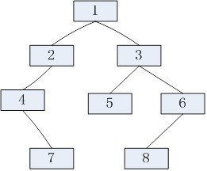

# [题目1385：重建二叉树](http://ac.jobdu.com/problem.php?pid=1385)

## 题目描述：

输入某二叉树的前序遍历和中序遍历的结果，请重建出该二叉树。假设输入的前序遍历和中序遍历的结果中都不含重复的数字。例如输入前序遍历序列{1,2,4,7,3,5,6,8}和中序遍历序列{4,7,2,1,5,3,8,6}，则重建二叉树并输出它的后序遍历序列。



## 输入：

输入可能包含多个测试样例，对于每个测试案例，

输入的第一行为一个整数n(1<=n<=1000)：代表二叉树的节点个数。

输入的第二行包括n个整数(其中每个元素a的范围为(1<=a<=1000))：代表二叉树的前序遍历序列。

输入的第三行包括n个整数(其中每个元素a的范围为(1<=a<=1000))：代表二叉树的中序遍历序列。

## 输出：

对应每个测试案例，输出一行：

如果题目中所给的前序和中序遍历序列能构成一棵二叉树，则输出n个整数，代表二叉树的后序遍历序列，每个元素后面都有空格。

如果题目中所给的前序和中序遍历序列不能构成一棵二叉树，则输出”No”。

## 样例输入：

```
8
1 2 4 7 3 5 6 8
4 7 2 1 5 3 8 6
8
1 2 4 7 3 5 6 8
4 1 2 7 5 3 8 6
```

## 样例输出：

```
7 4 2 5 8 6 3 1 
No
```

## 答疑：

解题遇到问题?分享解题心得?讨论本题请访问：http://t.jobdu.com/thread-8108-1-1.html

